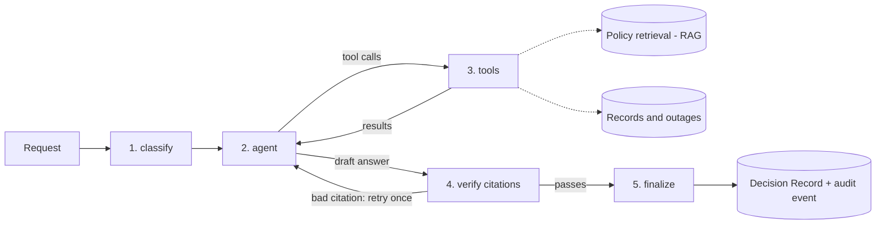

# Internal HR/IT Support Agent

An internal employee support agent for HR and IT — the AskHR / internal-helpdesk class
of enterprise agent, built from scratch. It is designed to resolve requests like "how
many vacation days do I have left?", "can you book me off next week?" and "is the VPN
down, or do I need a ticket?" by querying the requesting employee's own records and
searching company policy with **hybrid retrieval** — then terminating in exactly one
of four outcomes: **resolve**, **propose an action** into a human approval queue,
**escalate** to a human, or **refuse with a citation**. Every request also produces a
**Decision Record**: a persisted, structured account of why the agent did what it did.
All data is synthetic.

## How a request flows

The dotted lines show where the data comes from. An answer may cite only the chunks that
the retrieval returned for this request. A request that is out of scope, meets a model
failure, reaches the tool limit or fails the citation check twice ends in `escalate`
instead of an answer. Every path ends in `finalize`.

## Status

**Early.** The agent graph is built, but nothing serves it yet. There is no API or UI,
so nobody can ask it a question. What exists today:

- **Synthetic data.** Employees, leave balances, outages and policies, from one
  deterministic generator.
- **Identity from the session.** Tools read the employee from the request. The model
  never gives an employee id, and no tool accepts one.
- **Typed tools.** Five tools. Read tools query the employee's own records. The model
  never writes SQL.
- **Proposals, not writes.** Write tools add to an approval queue and change nothing.
- **Hybrid retrieval.** Vector search and full-text search, joined by reciprocal rank
  fusion.
- **Agent graph.** classify → agent ⇄ tools → verify → finalize, on LangGraph.
- **Citation check.** Every cited chunk must come from this request's search.
- **Decision Records.** One saved record per request: outcome, reason, evidence, versions
  and cost.
- **Model client.** Responses API, retry, fallback model and a cost in euros per call.
- **Audit log.** Every tool call, proposal and model call, with the request id and the
  actor.
- **Versioned prompts.** A prompt change without a version bump fails a test.
- **Tests.** Unit, component and database integration tests, with no model keys needed.
  The security tests run for every tool.

The details and the reasons are in [docs/architecture.md](docs/architecture.md). The Stack
table below shows which parts are built and which are planned.

## Roadmap

Rough build order:

- **Walking skeleton** — deterministic synthetic HR/IT data and a heading-aware chunker;
  session-bound identity and a full audit trail; the typed tool belt, with its
  access-control tests written before the tools they constrain; the agent graph,
  citation verifier and Decision Records; role-checked human approval behind a REST
  API; a Streamlit review surface.
- **Evaluation gate** — scenarios with authored expected outcomes, run n=3 and wired
  into CI, so a change that makes the agent behave worse fails the build. Prompts are
  versioned config: a wording change without a version bump is a test failure.
- **Depth** — the same tool belt over MCP, with identity bound at session
  initialization rather than passed as an argument; adversarial scenarios (prompt
  injection, colleague-data probing, approval bypass); retrieval evaluation and the
  chunking ablation, with tables published.
- **Governance** — DSAR export, retention purge, and a database-level assertion that no
  record was ever written without passing through human approval.
- **Observability and feedback** — per-node traces with cost and latency budgets, a
  usage dashboard, and a path that turns a thumbs-down into a new eval scenario.

## Stack

| Layer | Choice | Status |
|---|---|---|
| Language | Python 3.12 | In place |
| DB | PostgreSQL 16 + **pgvector** | In place |
| Tests | pytest, incl. DB-backed tests against the compose/CI Postgres | In place |
| CI | GitHub Actions — ruff + pytest always; eval gate when model secrets are configured | Partial — lint and tests |
| Packaging | Docker + docker-compose (db, api, ui) | Partial — db only |
| Orchestration | **LangGraph** | Partial — graph built and tested with a scripted model; nothing serves it yet |
| Model inference | **Azure OpenAI via AI Foundry** — a capable deployment for the agent loop, a small one for classification and claim extraction, `text-embedding-3-small` (1536-dim) | Partial — embeddings, and a model client with retry, fallback and cost; the graph uses the client, but only scripted replies are tested, with no live model run |
| API | FastAPI | Planned |
| Retrieval | Metadata pre-filtering → hybrid pgvector cosine + Postgres full-text ranking (`ts_rank_cd`), reciprocal-rank fusion (k=60), top-5 | Partial — hybrid search in place; metadata pre-filtering planned |
| Chunking | Pluggable `Chunker` interface; structural (heading-aware) default, chosen by ablation against fixed-size, recursive and semantic | Partial — structural chunker only |
| MCP | Official Python MCP SDK (FastMCP) exposing the tool belt; stdio + streamable HTTP | Planned |
| Eval tooling | Own deterministic harness (gates, trajectory, retrieval) + **RAGAS** for answer quality | Planned |
| Observability | **Langfuse** (cloud keys via `.env`; self-hostable for residency) | Planned |
| UI | Streamlit — chat, approval queue, decision records, cost | Planned |
