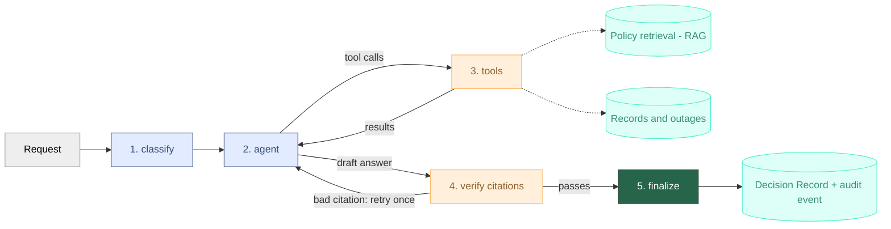

# Architecture

This file explains how the agent is built and why. It describes what exists today. What
is planned is in the roadmap in the README.

## How a request flows

The dotted lines show where the data comes from. The retrieval (RAG) is the
`search_policies` tool. The chunk ids it returns are the only ids an answer may cite.
Every path ends in `finalize`, which saves the Decision Record.

A request ends in `escalate` at these points:

| Step | Reason |
|---|---|
| classify | the request is outside HR and IT, or the classification failed |
| agent | no model answered, or the model sent tool arguments that were not valid JSON |
| agent | the next tool calls would go over the tool limit |
| verify | the answer cited a chunk this request did not retrieve, a second time |

The `refuse` node then writes the answer in the language of the request.

Every request ends in exactly one outcome:

| Outcome | When |
|---|---|
| `resolve` | the answer passed the citation check and no action was proposed |
| `propose_action` | the answer passed the check and the request proposed at least one action |
| `escalate` | a person has to take over: out of scope, a model failure, the tool limit, or a failed check |
| `refuse_with_citation` | part of the outcome list, but nothing sets it yet |

The rule is to escalate instead of guessing. Whenever the agent cannot continue safely,
it hands the request to a person.

## Data

All data is synthetic and comes from one deterministic generator (`data/generate.py`):
12 employees with leave balances, two IT outages and five HR and IT policies. The same
run always gives the same data. Some edge cases are planted on purpose, such as an
employee with no days left.

A heading-aware chunker splits each policy into sections. A chunk id has the form
`<policy>#<heading-slug>#<n>`, for example `vacation-policy#entitlement#0`. Citations and
the evaluation refer to chunks by this id, so the format is stable. Each section is
embedded with `text-embedding-3-small` (1536 dimensions) and stored with pgvector.

## Identity

The logged-in employee is bound once per request into a `RequestContext`. Tools and the
audit log read the employee and the request id from there. No tool takes an employee id
as an argument, so the model cannot ask for another employee's data. A test checks this
for every tool schema, and another test checks that no tool runs without a bound request.

Over REST, the employee comes from the `X-Employee-Id` header. This is a login stub: the
header is trusted, and the only check is that the employee exists. It is the one place
where identity enters, so real login (OIDC) would change only that function. No route
takes an employee id in the path, the query or the body, and a test checks this for every
route. The steps for real login are in [before-deploying.md](before-deploying.md).

## Tools

| Tool | What it does |
|---|---|
| `get_leave_balance` | the employee's own vacation days |
| `get_known_outages` | IT outages that are still open |
| `search_policies` | policy sections, found by meaning and by keywords |
| `submit_leave_request` | proposes a leave request |
| `create_ticket` | proposes an IT ticket |

The queries are typed and use parameters. The model never writes SQL.

**Writes are proposals.** The two write tools check the rules in code and then add a row
to `pending_actions`. They do not book leave or open a ticket. A person with the right
role approves the row later, in a separate flow. Sending the same proposal twice returns
the first one.

**Search.** `search_policies` joins two rankings with reciprocal rank fusion: vector
similarity (pgvector, cosine) and Postgres full-text search. It returns the top five
sections.

## Approval

A write tool only adds a row to `pending_actions`. The change happens later, in
`guardrails/approval.py`, when a person decides. The agent process never runs this code.

`decide(action_id, approver_id, approve)` works in this order:

1. **Role.** The approver must be an `hr_partner` or a `manager`.
2. **Self-approval.** The approver must not be the employee who made the request.
3. **Lock.** Both checks only read. After them, the action row is locked with
   `SELECT ... FOR UPDATE`, so two decisions on the same action run one after the other.
   The second one finds the action already decided and is refused.
4. **Reject.** The status becomes `rejected`. Nothing else is written.
5. **Approve.** The status becomes `approved`, the write is made, and the status becomes
   `executed`. A leave request adds a `leave_requests` row with the status `approved` and
   adds its days to `pending_days`. A ticket adds a `tickets` row.

All of this runs in one transaction. If the write fails, nothing is saved and the action
stays pending.

Every transition is audited with the approver as the actor, under the request id of the
original proposal, so the whole story of a request is in one place. The `action_executed`
event names the table and the row that was written. The business tables have no column
that points back to the action, so this event is the only link from a row to its approval.
A test uses it to check that no row in `leave_requests` or `tickets` exists without an
executed action.

**Design choices**
- The role check comes before the action is read, so someone without the role cannot find
  out which action ids exist.
- The queue also shows the approver's own requests, with `can_decide` set to false. The
  decision itself is still refused.
- Approvers are found by the role in the `employees` table. A role in a login token would
  not be trusted.

## REST API

| Route | What it does |
|---|---|
| `POST /chat` | runs the agent for one message and returns the answer, the outcome and the request id |
| `GET /approvals` | the actions waiting for approval, with their payload. Approvers only |
| `POST /approvals/{id}` | approves or rejects an action. The approver is the employee in the header |
| `GET /decisions/{request_id}` | the Decision Record. The employee who made the request, or an approver, can read it |
| `POST /feedback/{request_id}` | a rating (`up` or `down`) and an optional comment. Only the employee who made the request can send it |

| Status | When |
|---|---|
| 401 | the header is missing, or the employee is unknown |
| 403 | the employee may not do this: not an approver, or approving their own request |
| 404 | the action or record does not exist. A record that the employee may not read gives the same answer |
| 409 | the action was already decided |
| 422 | the body is not valid. Extra fields are refused, so a body cannot carry an employee id |

The graph is built on the first chat request and then reused. Tests replace it with a
stub, so the API tests need no model keys.

## The graph

The graph is a LangGraph `StateGraph`. The state holds the messages, the classification,
the chunk ids that the request retrieved, the ids of the proposed actions, the number of
tool calls used, the outcome and the evidence.

| Node | What it does |
|---|---|
| `classify` | one call to the small model with a strict JSON schema: family (`hr`, `it`, `other`), risk (`read`, `write`, `out_of_scope`) and language (`en`, `de`) |
| `agent` | one model call with the tools. The reply may ask for tool calls |
| `tools` | runs the requested calls with LangGraph's `ToolNode`, adds the chunk ids of each search to the citation whitelist, and counts the calls |
| `tool_limit_reached` | ends the request when the limit is reached |
| `verify` | the deterministic citation check on the draft answer |
| `refuse` | writes the answer for every escalation, in the language of the request |
| `finalize` | builds and saves the Decision Record. It runs on every path |

**Why classify is a separate step.**
- A request that is out of scope escalates before the agent runs. No tool is offered
  and none is called.
- The answer must fit a strict schema. An answer that does not fit escalates, so the
  graph never guesses a value.
- The language comes from the classification, so the refusal text is chosen without
  another model call.
- It uses the small model. A request that is clearly out of scope costs one small call
  and no agent loop.

The cost is one more model call on every request. A wrong `out_of_scope` escalates a
request that the agent could have answered. The classification is also a model answer,
so this check is not fully deterministic.

**Tool limit.** A request may use at most 8 tool calls (`MAX_TOOL_CALLS_PER_REQUEST`).
If the calls used plus the calls just requested would go over the limit, none of the new
calls run, and the request escalates. The calls of one reply are never cut to fit.

**Evidence.** Every step adds items to the request's evidence list: the classification,
each tool result, each model call and fallback, each check result, each retry and each
escalation with its reason. The list is the source for the Decision Record.

**Design choices**
- A node returns only the fields it changes. Lists such as the evidence and the chunk ids
  add up across nodes. Values such as the outcome and the tool counter are replaced.
- A proposal is a row in the database, and the graph ends after it. It does not pause for
  approval. The approver is another person who may answer much later, and the approval
  must be in the audit log. This is why the graph has no checkpointer and no
  `interrupt()`.
- Each request starts with one user message. The graph keeps nothing between requests.
- The model retry is our own code and not LangGraph's `RetryPolicy`. See the model client
  below.

## Citation check

Every `[chunk:<id>]` in the draft answer must be a chunk that this request retrieved. The
check is plain code, and no model judges it.

- If the answer passes, the request ends in `resolve` or `propose_action`.
- If it fails for the first time, the objection is saved in the state. The agent runs
  again and sees the objection as a system message. This is a loop in the graph, because
  no error happened and the second try needs a different input.
- If it fails a second time, the request ends in `escalate`.

## Decision Records

Every request that reaches the end of the graph saves one row in `decision_records`:

- the outcome and one sentence on why. The sentence is built from the evidence with fixed
  wording, so no model writes it
- the evidence in order, and the citations of the final answer
- the policy version, the prompt versions and every check result
- each model call with tokens and cost in euros, the totals, and the time taken
- the trace id, which is empty because tracing is not built yet

The record and the final `decision_recorded` audit event are saved in one transaction.
The request id is unique, so a request can have only one record.

**Policy version.** Each policy section is stored with the version from its policy file's
frontmatter. A record names the version that the database holds, not the version of the
files on disk. If sections of several versions are stored, the record names all of them.

## Orphan check

A proposal is saved when the tool runs. The record is saved later, in `finalize`. If the
process crashes between the two, the proposal has no record.

`flag_orphaned_actions` finds these rows and writes an `orphan_flagged` audit event for
each, with the actor `system`. It does not change the action.

- **Grace period.** Only actions older than `ORPHAN_GRACE_MINUTES` (default 10) are
  checked, so a request that is still running is never flagged.
- **No duplicates.** An action that already has an event is skipped, so running the check
  at every start adds nothing new. The check uses the action id, because one request can
  propose several actions.
- **Concurrent starts.** A transaction-level advisory lock makes two processes that start
  together flag each action only once.

We did not use one transaction for the whole request. It would stay open during the model
calls, hold locks, and roll back the audit trail of a crashed request. Short transactions
and a later check cost less. Nothing calls the check at startup yet.

## Audit log

`audit_log` is append-only. Every tool call, proposal, approval, rejection, execution,
feedback, model call and decision is written with the request id and the actor: `agent`, `employee:<id>`, `approver:<id>` or `system`.
The request id and the employee come from the request context, never from an argument.

## Model client and cost

All model calls go through one client that uses the OpenAI SDK and the Responses API with
Azure OpenAI.

- **Retry.** The client retries connection errors and the status codes 408, 409, 429 and
  5xx, up to two more times, with a delay that doubles. The SDK's own retries are turned
  off, so the limit is in one place.
- **Fallback.** If every try on the main model fails, the client tries the fallback model
  when one is set. If that fails too, it raises an error, and the graph escalates.
- **Evidence.** Every try, every switch to the fallback and the final failure is an
  evidence item, so the fallback chain can be read from the record alone.
- **Cost.** Each successful call gets its token counts and its cost in euros from a price
  table in the settings. Creating the client fails if a model has no price.

We wrote this retry and did not use LangGraph's `RetryPolicy`. It would run the whole node
again. It could not switch to a fallback model or record each try.

## Prompts

The agent prompt and the classifier prompt are YAML files in `prompts/`, each with an id
and a version. A test stores a checksum of every prompt, and it fails if the text changes
and the version does not.

## Tests

`make test` needs no model keys.

- **Unit tests** need no database. The model client, the cost, the verifier, the nodes and
  the state are tested with stand-ins.
- **Component tests** run the real graph with a scripted model and fake tools. The
  Decision Record is collected in a list, so there is no database.
- **Integration tests** use the compose Postgres (`make db-up`). They cover the tools, the
  schema, the audit log, saving Decision Records, the policy version, the orphan check and
  the approval. A comment marks them, and they are skipped when no database is reachable.
- **API tests** call the routes with a stub in place of the graph. The approval gate has
  end-to-end tests: the real tools propose, the API decides, and a check confirms that no
  row in `leave_requests` or `tickets` exists without an executed action.
- **Security tests** run for every tool: no identity argument, no run without a bound
  request, and write tools only add to the approval queue. A test also checks that no
  route takes an employee id, except through the header.

## Known limits

- A policy claim that has no citation at all passes the check. Claim extraction is planned.
- The trace id is always empty until tracing is built.
- `refuse_with_citation` is never set.
- If saving the record fails in `finalize`, the request fails.
- The policy version is read once at `finalize`. Re-seeding at that moment could make the
  record name the new version.
- No test runs the real graph with the real database from start to end, and no test calls
  a live model.
- Login is a header stub. Anyone who knows the header can act as any employee.
- Nothing calls the orphan check at startup.
- Pending actions never expire. The `expired` status exists, but nothing sets it.
- `GET /me/export` and `GET /usage` are not built.

What stands between this and a deployment is listed in
[before-deploying.md](before-deploying.md).
